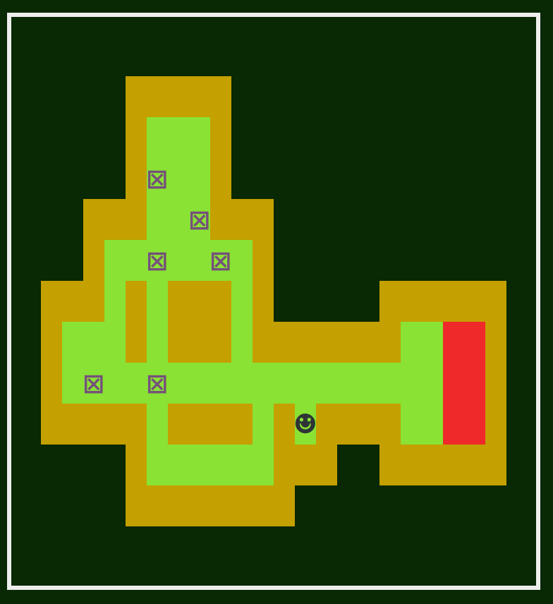

# Ziokoban

## Introduction

After attending a 5-day Functional Scala course by John A. De Goes in September 2018, I wanted to play around with the [ZIO](https://zio.dev) library.

Well, this is my ZIO playground project. I chose to make a game, because I wanted something with garanteed side effects. I chose [Sokoban](https://en.wikipedia.org/wiki/Sokoban), because it is one of my favorite games ever!

## Screenshot

## Functionality
The current features/restrictions are:
- Played in the terminal.
- Levels are read from a slc file, containing a set of sokobon levels. This file is not included.
  Example source of slc files is [this sokoban website](http://www.sourcecode.se/sokoban/levels)
- Slc file to use is configured in `ziokoban.conf`.  
- Currently only one level of the collection is played.
- Navigation using arrow keys and WASD keys.
- Undo moves with X key.
- Quit the game with the Q key.
- Built and tested on Arch Linux. Test on Windows showed issues with the Unicode characters used. (But these can be changed in the config file.)

## Used ZIO features
- ZIO ;-)
- Layers
- Queue
- Ref
- Schedule
- ZIO Config
- ZIO Test
 
## Ideas for future features 
My list of possible improvements and extentions:
- Add unit tests.
- Add logging. (displaying in seperate part of screen?)
- Support loading and playing level sets (examples on [this sokoban website](http://www.sourcecode.se/sokoban/levels))
- Add a game clock and game info/stats on screen.
- Add dead block detection. (real time parallel calculations and output)
- Use STM somewhere.
- Introduce second kind of GameOutput. (GUI)

## License
This project is licensed under the MIT License. See [LICENSE.txt](LICENSE.txt) fo details.

